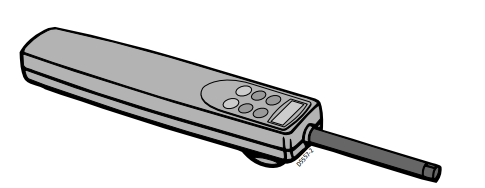
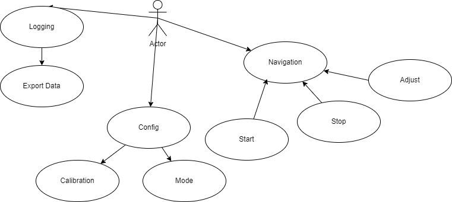

## Operating modes
The tiller pilot has four basic operating modes: 

• Standby mode: autopilot off

• Auto mode: autopilot engaged and locked onto a heading

• Track mode: autopilot on and maintaining a track between two waypoints 
created on a navigation system 

• WindTrim mode: autopilot on and maintaining a course relative to an 
apparent wind angle

## Features

- NMEA Compatible
- Waypoint System
- Inbuilt LCD Screen
- 6 Button Digital Keypad
- Automatic Tack

## Use Cases

### Navigation

#### Start / Stop
##### User Action -
 - Press start or stop button

##### System Response
- engage / disengage auto pilot control

#### Adjust
##### User Action -
 - Press one of the increment buttons

##### System Response
- increment current target angle by buttons value

### Config

#### Mode
##### User Action
- Press change mode button

##### System Response
 - Cycles through the 4 modes

#### Calibration
##### User Action
- Cycle through options to correct menu
- Use increment buttons to change value

##### System Response

- Save changed setting and maintain calibration