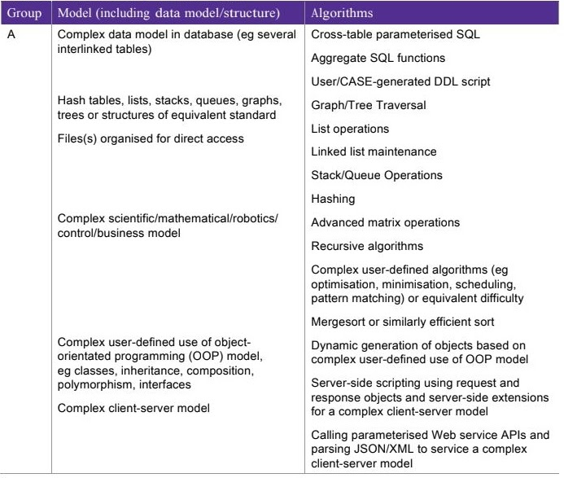
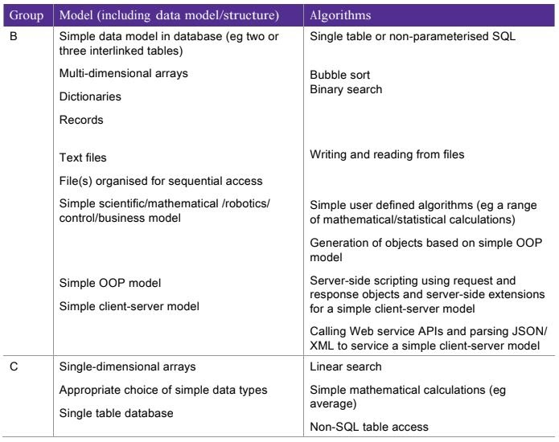

## Technical Solution Document Guidance (42/72 Marks)

#### From college source 'Projects PowerPoint' :

This is the main part of the project where most marks are awarded. It is split into two parts:

-The completeness of the solution
-The techniques used

##### Completeness of the solution
Total of 15 marks
The marks are split into 3 bands depending of if the solution completely meets the requirements and resolves the issue (meets all / almost all requirements, meets many requirements, meets some requirements)
Total marks is based off of judgement

##### Techniques Used
Total of 27 marks
Based on how proficient you are at usng certain programming techniques

##### Evidence required
- 'Self-documenting code', which means code that uses meaningful identifiers, logical structures and annotation (comments) that allows a third party to understand it.

- An overview guide which, amongst other things, includes the names of entities such as executables, data filenames/URLs, database names and pathnames.

- Explanations of particularly difficult-to-understand code sections.

- A careful division of the presentation of the code listing into appropriately labelled sections.

#### From adacomputerscience.org/concepts/projaqa_technical?topic=aqa_nea_project:

3 criteria:

##### Code:

You must print out all of your code. Code listings need to be large enough to read, and it should be clear what part of the system each listing relates to. Avoid printing code on black backgrounds, as this is harder to read and wastes ink.

There are many ways to present your work. For example:
Function name: ()
Purpose: ()
Explanation: ()
Code: []

##### Completeness:

Completeness is what it sounds like: does your solution meet all of its stated objectives, and how well does it do this? This will generally be assessed by looking at your evaluation and testing, but the examiner will also look at your code.

Very important note: in this section, if your objectives are scant or poorly defined, your work will be assessed against a set of objectives that should have been written for a system of this nature, not against the objectives you actually wrote. An example of this for the specimen system is omitting to specify that a user must be able to indicate that they have forgotten their password (and not specifying a way that this would be dealt with). Users forget passwords all the time, so any login system must provide this function. It is very common in database systems for students to specify the creation of data but to forget to specify the need to update and delete selected data. Similarly, in quiz systems, users need to be able to create new questions, amend them and delete them if necessary.

##### Techniques:

Techniques is all about how well you code.

Your techniques will be assessed first of all in terms of the technical skills in evidence. It is really useful to provide an introductory list of the advanced features that you have used, cross-referenced to your work. For example, you might have implemented a stack and coded the associated pop, push, and peek methods. The more examples you have, the more likely your work will be assessed in the highest mark band.

Once the complexity of the skills you have used has been assessed, the examiner will be looking for evidence of good technique (coding style). The table below explains the three skill levels. Again, you may like to highlight in your report where the person marking your work can find evidence (especially for the higher-order skills category).

###### Examples:

##### Basic Skills:

- Meaningful identifier names
- Annotations used where required

##### Intermediate Skills

-

